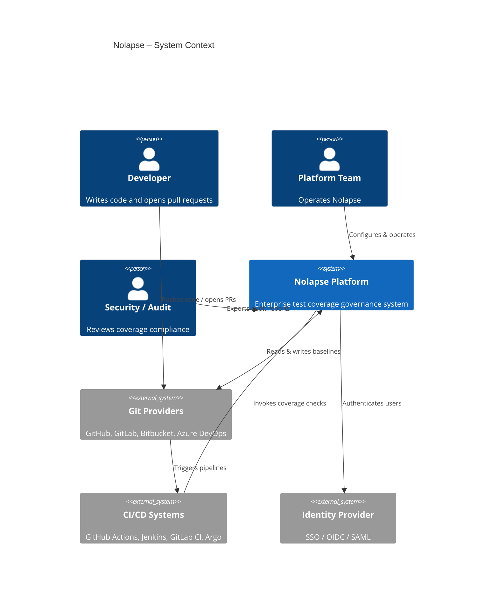
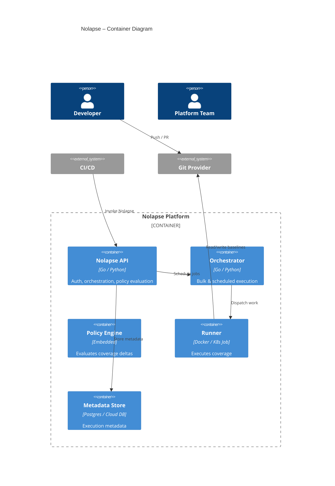
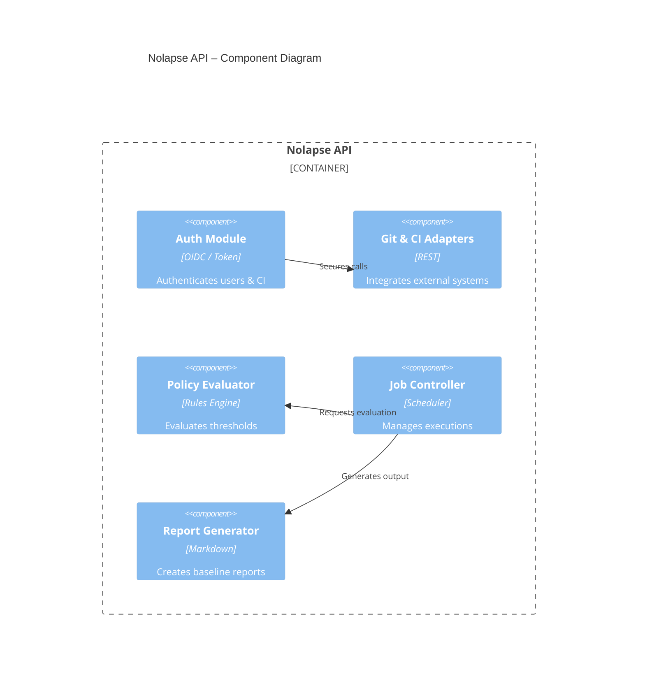
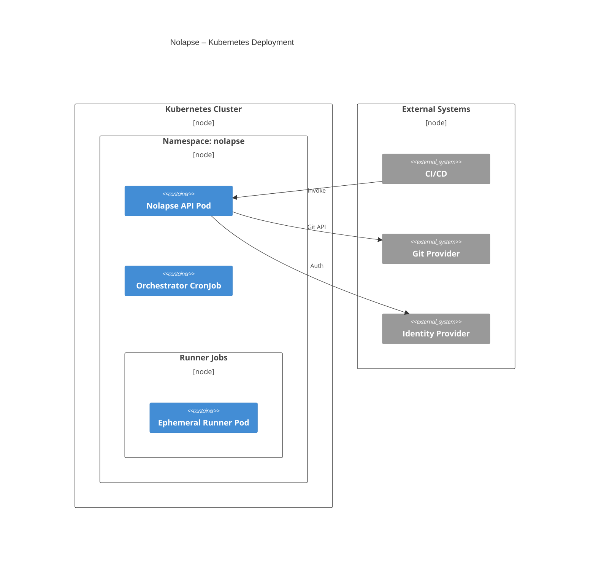

# Nolapse – Overall Architecture (C4 Model)

This section defines the **overall system architecture of Nolapse using the C4 model**, progressing from high-level context to deployable components. These diagrams are intended for architects, senior engineers, and review boards.

---

## C4 – Level 1: System Context Diagram

### Purpose

Shows Nolapse as a system in its environment and how external actors interact with it.

---

## C4 – Level 2: Container Diagram

### Purpose

Breaks Nolapse into major deployable/runtime containers.

---

## C4 – Level 3: Component Diagram (Nolapse API)

### Purpose

Explains internal structure of the most critical container.

---

## C4 – Level 4: Deployment Diagram (Kubernetes)

### Purpose

Shows how Nolapse is deployed in a production cloud environment.

---

## Architecture Notes

* Nolapse follows **control-plane vs execution-plane separation**
* Runners are fully ephemeral and stateless
* Git is the system of record for baselines
* Metadata DB is optional for OSS, mandatory for Enterprise

---

**End of C4 Architecture**
