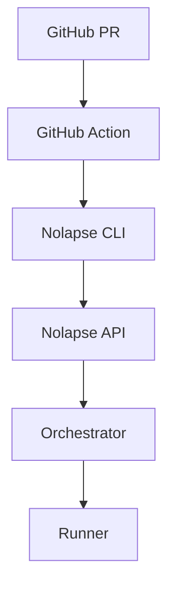

> **ARCHIVED** — This is v2.0 (Coverage Governance framing)
> **Current version:** [v3.0 - AI Agent Governance](../../product/mvp-definition.md)

---

# Nolapse – MVP Definition

## CPTO Perspective: What We Ship First (and What We Explicitly Do NOT)

This document defines the **Minimum Viable Product (MVP)** for Nolapse. It is written from a **CPTO lens**, balancing:

* Time-to-market
* Technical risk
* Enterprise credibility
* Learning velocity

The MVP is **not a prototype**. It is a **production-grade, opinionated subset** of the full platform you have already designed.

---

## 1. MVP Philosophy

The Nolapse MVP must:

1. Solve **one painful, real problem** extremely well
2. Be **secure and trustworthy** from day one
3. Validate the **execution lifecycle + policy model**
4. Be usable in **real CI pipelines**
5. Avoid premature breadth

> MVP goal: **Prove coverage-baseline enforcement works reliably in real CI.**

---

## 2. Target MVP User

### Primary Buyer — Platform Team

The Platform Team evaluates, deploys, and champions Nolapse internally. They are the MVP's decision-maker.

* Owns CI standards across the organization
* Manages coverage enforcement today through bespoke scripts or inconsistent thresholds
* Is willing to be hands-on during the design partner phase
* Already uses GitHub Actions in at least some CI pipelines

The MVP must earn the Platform Team's trust before it earns anyone else's.

### Primary End User — Developer

* Backend / full-stack developer on GitHub + GitHub Actions
* Works on PR-driven workflows
* Wants confidence that coverage does not regress — and that failure signals are fair

The developer does not choose Nolapse. The Platform Team deploys it. But if the developer doesn't trust the signal, the Platform Team loses it.

---

## 3. MVP Use Case (Golden Path)

> *"As a developer, when I open a PR, Nolapse checks that my code coverage does not drop compared to the main branch and fails the PR if it does."*

That’s it. Everything else is secondary.

---

## 4. MVP Scope (What’s IN)

### 4.1 Control Plane

✅ API

* Trigger execution
* Get execution status

✅ Orchestrator

* Single‑region scheduling
* Basic tenant isolation (single tenant)

✅ Policy Engine

* Coverage ≥ baseline policy
* Strict mode only

---

### 4.2 Execution Plane

✅ Runner

* Node.js projects only
* Jest + NYC coverage
* Canonical coverage normalization

❌ No parallel execution
❌ No Firecracker / advanced isolation

---

### 4.3 CI Integration

✅ GitHub Actions only

* Composite action
* OIDC auth

❌ GitLab
❌ Jenkins

---

### 4.4 CLI

✅ `nolapse run`

* Minimal flags
* Human‑readable output

❌ No interactive modes

---

### 4.5 Persistence & Reporting

✅ Execution metadata

* Status
* Duration
* Coverage summary

❌ No UI
❌ No dashboards
❌ No long‑term analytics

---

## 5. Explicit Non‑Goals (Critical)

The MVP explicitly does **NOT** include:

* Multi‑language support
* Multi‑tenant SaaS
* Baseline editing via API
* Advanced policies (branch‑aware, file‑level)
* Performance optimizations
* Visual dashboards

These are **deliberately deferred**.

---

## 6. MVP Architecture Slice

Everything else is stubbed or mocked.

---

## 7. Success Metrics (MVP Validation)

### Technical

* ≥95% successful runs
* <5 min execution time (Node)
* Zero security incidents

### Product

* Developers understand failure reason
* Policy failures feel fair
* Developer signal dispute rate < 10%

### Business

* 3–5 paying design partner organizations onboarded
* At least one case study published (customer quoted, metrics documented)
* GitHub Actions Marketplace listing live
* Time to first baseline (new repo) < 30 minutes confirmed with at least 2 design partners

These are not vanity metrics. They are the Phase 1 go/no-go criteria from the [Roadmap](roadmap.md). MVP close is not when the feature list is done — it is when these are true.

---

## 8. MVP Delivery Milestones

| Phase    | Outcome                |
| -------- | ---------------------- |
| Week 1–2 | CLI + runner spike     |
| Week 3–4 | API + orchestrator     |
| Week 5   | GitHub Action          |
| Week 6   | Design partner rollout |

---

## 9. MVP Kill Criteria

We stop or pivot if:

* Coverage signal is noisy or unreliable
* CI integration feels fragile
* Users don’t trust the failure signal

---

## 10. CPTO Recommendation

> **Ship a narrow, boring, trustworthy MVP.**

If developers trust the signal, Nolapse earns the right to expand.

---

## 11. What Comes Immediately After MVP

Once validated:

1. Add Python and Go language support
2. Add GitLab CI component (Phase 1 close requirement)
3. Add multi-tenant SaaS deployment
4. Introduce org-wide compliance dashboard (Phase 2 entry)

These are sequenced by the [Roadmap](roadmap.md) Phase 1 scope, not by feature preference.

---

## 12. MVP Close as Acquisition Signal

The MVP is not just a product milestone — it is Phase 1 of the acquisition timeline.

At MVP close, each of the four target acquirers should be able to see:

* **GitHub:** Nolapse running as a first-class GitHub Actions Marketplace listing, with design partner case studies mentioning GitHub Actions
* **GitLab:** The GitLab CI component published in the component catalog (required before Phase 1 close)
* **Codecov / Sentry:** At least one design partner case study documenting Nolapse + Codecov co-use patterns
* **SonarSource:** Nolapse visible in at least one enterprise account where SonarQube is also deployed

This visibility is not accidental. It is a prerequisite. If Phase 1 closes without all four ecosystem signals live, the acquisition timeline is behind schedule.

See the [Strategic Decisions Log](strategic_decisions.md) and [Roadmap](roadmap.md) for the full acquisition timeline.

---

**End of MVP Definition**
