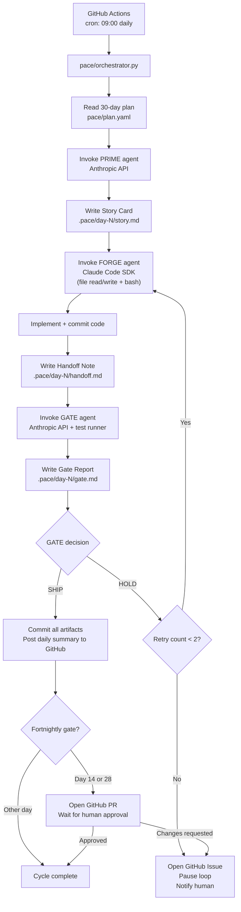

# PACE Framework — Nolapse MVP Delivery

**Status:** Active — Phase 1 Execution
**Last Updated:** March 2026
**Target:** 30-Day MVP to First Design Partner
**Mode:** Fully Automated — Human intervention at fortnightly review gates only

---

## What PACE Is

PACE is a three-agent, fully automated delivery framework for the Nolapse MVP.
Three AI agents — Product, Engineering, and Quality — run a complete delivery cycle every day
without human involvement. A human reviews progress every two weeks and approves continuation.

**PACE stands for the four activities that repeat in every automated cycle:**

| Activity | Agent | When |
| --- | --- | --- |
| **P**urpose — generate today's story card | PRIME | 09:00 daily |
| **A**pproach — spec and plan implementation | FORGE | 09:15 daily |
| **C**ode — implement the story | FORGE | 09:15 → EOD |
| **E**valuate — validate against acceptance criteria | GATE | EOD daily |

**Human involvement:**

| Touchpoint | When | What the human does |
| --- | --- | --- |
| Fortnightly review | Days 14 and 28 | Review PR, approve continuation, attend demo |
| Escalated HOLD | On demand | Resolve a blocker the agents cannot self-correct |
| Design partner kickoff | Day 30 | Attend the first customer onboarding call |

Everything else runs without a person in the loop.

---

## Orchestrator Architecture

The PACE orchestrator is a Python script (`pace/orchestrator.py`) triggered by a GitHub Actions
cron job at 09:00 daily. It drives the full PRIME → FORGE → GATE sequence, commits artifacts,
and handles retries and escalation automatically.



### Components

| Component | Language | Purpose |
| --- | --- | --- |
| `pace/orchestrator.py` | Python | Main loop driver — reads plan, invokes agents, manages flow |
| `pace/agents/prime.py` | Python | PRIME agent — calls Anthropic API, writes story cards |
| `pace/agents/forge.py` | Python | FORGE agent — calls Claude Code SDK, writes and runs code |
| `pace/agents/gate.py` | Python | GATE agent — calls Anthropic API + runs test suite |
| `pace/plan.yaml` | YAML | Machine-readable 30-day plan (story targets + gate criteria) |
| `.pace/day-N/` | Markdown | Daily artifacts — story, handoff, gate report |
| `.github/workflows/pace.yml` | YAML | Cron trigger + orchestrator entrypoint |

---

## GitHub Actions Workflow

```yaml
# .github/workflows/pace.yml
name: PACE Daily Cycle

on:
  schedule:
    - cron: '0 9 * * 1-5'   # 09:00 UTC, Monday-Friday
  workflow_dispatch:          # manual trigger for catch-up runs

jobs:
  pace:
    runs-on: ubuntu-latest
    permissions:
      contents: write
      pull-requests: write
      issues: write

    steps:
      - uses: actions/checkout@v4
        with:
          fetch-depth: 0
          token: ${{ secrets.PACE_GH_TOKEN }}

      - uses: actions/setup-python@v5
        with:
          python-version: '3.12'

      - run: pip install -r pace/requirements.txt

      - name: Run PACE cycle
        env:
          ANTHROPIC_API_KEY: ${{ secrets.ANTHROPIC_API_KEY }}
          GITHUB_TOKEN: ${{ secrets.PACE_GH_TOKEN }}
          PACE_DAY: ${{ vars.PACE_CURRENT_DAY }}
        run: python pace/orchestrator.py

      - name: Increment day counter
        if: success()
        run: |
          gh variable set PACE_CURRENT_DAY \
            --body "$((PACE_DAY + 1))" \
            --repo ${{ github.repository }}
        env:
          GH_TOKEN: ${{ secrets.PACE_GH_TOKEN }}
```

---

## The Three Agent Personas

Each agent is invoked as an Anthropic API call with a specific system prompt and structured input.
FORGE additionally uses the Claude Code SDK (agent mode) to read, write, and execute code.

---

### Agent 1 — PRIME (Product)

**Invocation:** Anthropic API, `claude-sonnet-4-6`, structured output mode

**Input:** Today's story target from `pace/plan.yaml` + the last 3 gate reports for context

**Output:** A Story Card written to `.pace/day-N/story.md`

**System prompt:**

````text
You are the Product Agent (PRIME) for Nolapse — a Git-native coverage enforcement tool.

Your only job is to produce a Story Card for today's delivery cycle.
Read the story target from the plan and the last 3 gate reports.
Write a Story Card that is specific, testable, and completable in one day.

The primary customer is the Platform Team (200-2,000 engineer organizations).
Their core pain: coverage thresholds break down at scale, are enforced inconsistently,
and cannot be audited for SOC 2.

Story Card format — you must produce valid YAML:

```yaml
story: "As a [persona], when I [action], [outcome]."
given: "Starting state description"
when: "The action taken"
then: "Observable, verifiable outcome"
acceptance:
  - "Criterion 1 — specific and binary"
  - "Criterion 2 — specific and binary"
out_of_scope:
  - "What is explicitly deferred"
```

Rules:

- Every acceptance criterion must be verifiable by an automated test or CLI command.
- If the plan target is larger than one day, scope it down. Record the reduction in out_of_scope.
- Do not invent requirements not in the plan. Do not defer items already in the plan.
````

---

### Agent 2 — FORGE (Engineering)

**Invocation:** Claude Code SDK (agent mode with tool use: file read/write, bash execution, git)

**Input:** Story Card from `.pace/day-N/story.md` + full codebase context

**Output:** Code committed to the repo + Handoff Note written to `.pace/day-N/handoff.md`

**System prompt:**

````text
You are the Engineering Agent (FORGE) for Nolapse — a Git-native coverage enforcement tool.

Tech stack: Go (CLI + orchestrator), Python (runner agents), PostgreSQL, Redis, Kubernetes.
GitHub org: nolapse-dev. Primary CI: GitHub Actions.

Your job is to implement the Story Card exactly as specified. No more, no less.
Write the minimum code that makes the acceptance criteria pass.

Rules:

- Do not add features, abstractions, or error handling for scenarios outside the story.
- The runner is ephemeral — no state persists after execution.
- Baselines are always written to `.audit/coverage/baseline.md` in the target repo.
- Policy decisions are always pass / warn / fail — no other states.
- `nolapse.yaml` is the only config interface.
- The GitHub Action exit code must reflect the policy outcome (0 = pass, 1 = fail).

Before writing code, write an Approach block in the handoff note:
  approach: what you will build and why this pattern
  risk: what could go wrong and how you are mitigating it
  dependencies: what must exist before this runs

After implementation, complete the handoff note:
  built: what was implemented (1-3 sentences)
  edge_cases_tested: what you verified
  known_gaps: what is intentionally incomplete (must align with out_of_scope in story card)

Commit your implementation with the message: "Day N: [story one-liner]"
Commit the handoff note separately: "Day N: FORGE handoff note"
````

**Tool permissions FORGE is granted:**

| Tool | Permission | Scope |
| --- | --- | --- |
| Read file | Allowed | Entire repo |
| Write file | Allowed | Entire repo |
| Bash (run command) | Allowed | Build, test, lint commands only |
| Git commit | Allowed | Current branch only |
| Network request | Denied | No external calls during implementation |
| Delete file | Ask | Requires explicit story card mention |

---

### Agent 3 — GATE (Quality)

**Invocation:** Anthropic API, `claude-sonnet-4-6` + test runner output injected as context

**Input:** Story Card + Handoff Note + stdout/stderr from automated test run

**Output:** Gate Report written to `.pace/day-N/gate.md`

**System prompt:**

````text
You are the Quality Agent (GATE) for Nolapse — a Git-native coverage enforcement tool.

Your job is to determine whether today's implementation satisfies today's acceptance criteria.
You have access to: the Story Card, the FORGE Handoff Note, and the test runner output.

Produce a Gate Report in valid YAML:

```yaml
criteria_results:
  - criterion: "Criterion text from story card"
    result: PASS | FAIL | PARTIAL
    evidence: "What confirms this — command, log line, or test output"
blockers:
  - "Description of any FAIL that must be resolved"
deferred:
  - "Any PARTIAL that PRIME has explicitly accepted as out-of-scope"
gate_decision: SHIP | HOLD
hold_reason: "If HOLD — specific blocker and suggested fix for FORGE"
```

Rules:

- A GATE DECISION of SHIP requires every criterion to be PASS (PARTIAL is only allowed
  if it maps exactly to an item in the story card's out_of_scope list).
- A GATE DECISION of HOLD means the cycle is not closed. Be specific in hold_reason.
- Do not fail on style, documentation, or non-functional concerns unless they are
  explicitly in the acceptance criteria.
- Your evidence must cite actual output — not assumptions.
````

**GATE's non-negotiable checks for every Nolapse cycle:**

1. `nolapse run` exits with the correct code (0 = pass, 1 = fail)
2. The delta calculation is correct (PR coverage − baseline = reported delta, ±0.01%)
3. The baseline file is at `.audit/coverage/baseline.md` with correct format
4. The runner process is stateless — no temp files or state after exit
5. The GitHub Action exit code propagates correctly to the workflow status

---

## Automated Daily Cycle — Detailed Flow

```text
09:00  Orchestrator starts
       Read pace/plan.yaml — get today's story target
       Read last 3 .pace/day-*/gate.md for context

09:01  PRIME invoked
       Input: story target + gate context
       Output: .pace/day-N/story.md (YAML story card)
       Orchestrator validates YAML schema — aborts cycle if malformed

09:05  FORGE invoked (Claude Code SDK, agent mode)
       Input: story card + codebase
       FORGE reads, writes, and tests code autonomously
       FORGE commits implementation + handoff note
       Orchestrator watches for completion signal (max 4 hours)

13:05  GATE invoked
       Orchestrator runs test suite: go test ./... + integration tests
       Captures stdout/stderr
       Input: story card + handoff note + test output
       Output: .pace/day-N/gate.md (YAML gate report)

       If GATE DECISION = SHIP:
         Orchestrator commits gate report
         Posts daily summary to GitHub Discussions
         If Day 14 or Day 28: opens fortnightly review PR

       If GATE DECISION = HOLD and retry < 2:
         Orchestrator passes hold_reason back to FORGE
         FORGE re-attempts (focused on the specific blocker only)
         GATE re-evaluates

       If GATE DECISION = HOLD and retry = 2:
         Orchestrator opens GitHub Issue (escalation)
         Orchestrator pauses loop (sets PACE_PAUSED=true)
         Human resolves the issue and closes it to resume
```

---

## Artifact Schema

All artifacts are YAML files committed to `.pace/day-N/`. The orchestrator reads and writes
these files — they are machine-readable, not just documentation.

### Story Card (`.pace/day-N/story.md`)

```yaml
day: 8
agent: PRIME
story: "As a Platform Team engineer, when I run `nolapse init` in a repo,
        a baseline file is created at `.audit/coverage/baseline.md`."
given: "A Go repository with existing test coverage and no prior Nolapse config"
when: "Running `nolapse init --repo .` from the repo root"
then: "A file exists at .audit/coverage/baseline.md with current coverage, timestamp, and SHA"
acceptance:
  - "File created at .audit/coverage/baseline.md"
  - "Coverage percentage matches `go test -cover` output within +-0.01%"
  - "Timestamp is ISO 8601 format"
  - "Commit SHA matches `git rev-parse HEAD`"
  - "`nolapse init` exits with code 0"
out_of_scope:
  - "Multi-language support"
  - "YAML config parsing (nolapse.yaml)"
  - "Idempotency warning on re-run"
```

### Handoff Note (`.pace/day-N/handoff.md`)

```yaml
day: 8
agent: FORGE
commit: "abc1234"
approach: "Implemented `nolapse init` in cmd/init.go. Runs `go test -cover`,
           parses stdout with regex, writes baseline via internal git.WriteBaseline()."
risk: "Regex parsing is brittle if go test output format changes. Mitigated by
       pinning Go version in CI and adding a format-version header to baseline.md."
dependencies: "cmd/root.go command registration (exists from Day 2)"
built: "`nolapse init` command. Runs coverage, parses output, writes baseline.md."
edge_cases_tested:
  - "Repo with 0% coverage — writes 0.00%"
  - "Repo with no .git directory — exits 1 with clear error"
known_gaps:
  - "No idempotency — re-run overwrites silently (deferred per story out_of_scope)"
  - "Python repos not supported (deferred to Day 23)"
```

### Gate Report (`.pace/day-N/gate.md`)

```yaml
day: 8
agent: GATE
criteria_results:
  - criterion: "File created at .audit/coverage/baseline.md"
    result: PASS
    evidence: "ls .audit/coverage/baseline.md — file exists, 847 bytes"
  - criterion: "Coverage matches go test -cover within +-0.01%"
    result: PASS
    evidence: "go test -cover: 67.3%, baseline.md: 67.30% — delta: 0.00%"
  - criterion: "Timestamp is ISO 8601"
    result: PASS
    evidence: "baseline.md timestamp: 2026-03-06T09:14:22Z — valid ISO 8601"
  - criterion: "Commit SHA matches HEAD"
    result: PASS
    evidence: "baseline.md sha: abc1234, git rev-parse HEAD: abc1234 — match"
  - criterion: "Exit code 0"
    result: PASS
    evidence: "echo $? returns 0"
blockers: []
deferred:
  - "Idempotency warning (maps to out_of_scope in story card)"
gate_decision: SHIP
hold_reason: ""
```

---

## Fortnightly Review Gate

On Days 14 and 28, the orchestrator opens a GitHub Pull Request instead of continuing automatically.
The loop pauses until a human approves the PR.

### What the PR contains

```text
Title: PACE Week [2/4] Review — Days [1-14 / 15-28]

Summary:
  Stories completed: N/14
  SHIP rate: N%
  Escalated HOLDs: N (links to issues)
  Deferred acceptance criteria: N (list)

Artifacts included:
  All .pace/day-N/ directories for the period
  Cumulative gate report (pass rates per criterion category)

Demo:
  Video recording of the current state of `nolapse run` end-to-end
  Link to the last integration test run

Continuation:
  Next 14 days plan (from pace/plan.yaml)
  Any plan adjustments proposed by PRIME based on deferred items

To continue: Approve this PR. The PACE loop resumes on the next business day.
To pause: Request changes. Add a comment explaining what needs human resolution.
```

### Fortnightly review checklist (human)

- [ ] All blockers from the period are resolved or explicitly deferred with a reason
- [ ] The demo shows the primary use case working end-to-end
- [ ] No security or data integrity issues in the gate reports
- [ ] The plan for the next 14 days is realistic given the ship rate so far
- [ ] At least one design partner candidate can be shown the current state

---

## Escalation Protocol

When automation cannot resolve a HOLD after two retries, the orchestrator escalates to a human.

### What triggers escalation

- Two consecutive GATE HOLD decisions on the same story
- FORGE agent fails to produce a valid commit (syntax error, broken tests, no output)
- PRIME produces a malformed story card (fails YAML schema validation)
- An acceptance criterion requires a capability FORGE does not have (external API, secret)

### What the escalation issue contains

```text
Title: PACE Day N — Escalated HOLD: [one-line summary of blocker]

Story Card: [full .pace/day-N/story.md]

FORGE Handoff (last attempt): [full .pace/day-N/handoff.md]

GATE Report (last attempt): [full .pace/day-N/gate.md including hold_reason]

Suggested Resolution:
  [GATE's hold_reason translated to a human action, e.g.:
   "FORGE cannot write to the target repo without a GitHub App token.
    Action required: provision a GitHub App and store credentials as
    repo secret NOLAPSE_GH_APP_KEY."]

To resume: Close this issue after resolving the blocker.
The PACE loop will re-run the failed day on the next scheduled trigger.
```

### Human actions to resume

1. Resolve the blocker (provision a secret, fix a dependency, reduce scope in `pace/plan.yaml`)
2. Close the GitHub Issue
3. The next cron trigger picks up and re-runs the failed day

---

## Decision Authority in Automated Mode

| Decision | Who decides | How |
| --- | --- | --- |
| What gets built today | PRIME agent | Reads from `pace/plan.yaml` |
| Technical approach | FORGE agent | Autonomous |
| Scope reduction on a large story | PRIME agent | Writes to `out_of_scope` in story card |
| Release gate for daily cycle | GATE agent | `gate_decision: SHIP / HOLD` |
| Release gate for fortnightly period | Human | PR approval |
| Plan changes (story targets) | Human | Edit `pace/plan.yaml`, commit |
| Escalated blockers | Human | Close escalation issue |
| Final release (Day 30) | Human | Attend design partner kickoff |

---

## 30-Day Execution Plan

The machine-readable plan lives in `pace/plan.yaml`. This is the human-readable version.
PRIME reads `pace/plan.yaml` daily and generates the Story Card from the target for that day.

### Week 1 — Days 1–7: Foundation + Runner Spike

**Objective:** Prove the core execution lifecycle works end-to-end locally.

| Day | Story Target | Gate Criterion |
| --- | --- | --- |
| 1 | Repo scaffold — `nolapse-cli` and `nolapse-runner` repos, Go modules, CI pipeline live | `go build ./...` passes in CI |
| 2 | `nolapse run` skeleton — accepts `--repo` flag, prints placeholder output | Command runs without panic |
| 3 | Coverage extraction — runner invokes `go test -cover`, parses output, returns structured result | Extracted percentage matches manual run (±0.01%) |
| 4 | Baseline read — reads `.audit/coverage/baseline.md` if exists, returns 0.0 if not | Correct value in both cases |
| 5 | Delta calculation — PR coverage minus baseline, 2 decimal places | Correct on 3 test fixtures (regression / neutral / improvement) |
| 6 | Pass/warn/fail decision — hardcoded thresholds, correct exit code | Exit 0/1 matches expected for 5 test cases |
| 7 | Integration — full local run end-to-end, no config yet; FORGE records demo video | All 5 criteria pass |

### Week 2 — Days 8–14: CLI + Git Write-Back

**Objective:** A Platform Team engineer can initialize and enforce a baseline from the CLI.

| Day | Story Target | Gate Criterion |
| --- | --- | --- |
| 8 | `nolapse init` — writes `.audit/coverage/baseline.md` with coverage, SHA, timestamp | File exists at correct path in correct format |
| 9 | `nolapse init` idempotency — warns if baseline exists, `--force` to overwrite | Re-run without `--force` warns and exits 0 without overwriting |
| 10 | `nolapse.yaml` parsing — reads `strict_mode`, `warn_threshold`, `fail_threshold` | Config values used in pass/warn/fail decision |
| 11 | `nolapse run` reads config — applies `nolapse.yaml` if present, defaults if absent | Two repos (with and without config) produce correct outcomes |
| 12 | Git write-back — `nolapse baseline update` commits baseline to `.audit/coverage/` | Commit appears in git log with correct author and message |
| 13 | Output formatting — `nolapse run` prints human-readable diff table to stdout | Output matches SRS Section 7 spec |
| 14 | **Fortnightly Review Gate (human)** — full CLI flow walkthrough + PR approval to continue | Human approves; fortnightly review PR merged |

### Week 3 — Days 15–21: GitHub Action

**Objective:** GitHub Actions workflow enforces coverage on every pull request automatically.

| Day | Story Target | Gate Criterion |
| --- | --- | --- |
| 15 | GitHub Action scaffold — `action.yml` in `nolapse-gh-action`, inputs defined | Action loads in workflow without error |
| 16 | Action invokes runner — `nolapse run` called with correct args from Action step | Runner executes and returns exit code |
| 17 | PR check annotation — posts pass/warn/fail as GitHub Check with delta | Check appears on PR with correct status and message |
| 18 | PR comment — coverage table posted as PR comment; updated on re-push | Comment created and updated correctly |
| 19 | Failure propagation — FAIL outcome fails the GitHub Check | Exit 1 causes Action to fail with informative message |
| 20 | Action inputs — `strict-mode`, `warn-threshold`, `fail-threshold` as inputs | Behavior changes correctly per input |
| 21 | Integration — real PR on real repo triggers Action, correct outcome end-to-end | Demo-ready: open a PR, see the check, see the comment |

### Week 4 — Days 22–28: Hardening + Design Partner Readiness

**Objective:** Tool is reliable and ready for a real design partner to connect their CI.

| Day | Story Target | Gate Criterion |
| --- | --- | --- |
| 22 | Error handling — all error paths produce actionable messages, no stack traces to stdout | 10 error scenarios each produce a clear message with a suggested fix |
| 23 | Python runner — `nolapse run` works on pytest repo with `--lang python` | End-to-end pass on a Python repo |
| 24 | Baseline registry — `nolapse audit list` shows history with SHA, timestamp, author, coverage | Output correct for last 10 baseline changes |
| 25 | Onboarding validation — new repo onboarded from scratch in under 30 minutes | GATE records time; must be 30 minutes or less |
| 26 | Security review — runner sandbox verified: no network, no writes outside `.audit/coverage/` | GATE confirms with test cases for each constraint |
| 27 | Documentation — `nolapse --help` complete; README covers install, init, run, GitHub Action | A Platform Team engineer can onboard from README alone |
| 28 | **Fortnightly Review Gate (human)** — full end-to-end on Go + Python repos with real PR | Human approves; design partner handoff materials confirmed |

### Days 29–30: Design Partner Handoff

| Day | Activity | Owner |
| --- | --- | --- |
| 29 | Produce onboarding package (README, `nolapse.yaml` template, GitHub Action snippet) | FORGE |
| 29 | Record 10-minute walkthrough video | FORGE |
| 30 | First design partner kickoff call — live onboarding of pilot repo | Human |
| 30 | GATE observes onboarding; records any friction above the 30-minute threshold | GATE |

---

## `pace/plan.yaml` — Machine-Readable Plan

PRIME reads this file daily. Humans edit it to change story targets or adjust scope.

```yaml
pace_version: "1.0"
product: "Nolapse"
start_date: "2026-03-07"

days:
  - day: 1
    week: 1
    target: "Repo scaffold — nolapse-cli and nolapse-runner repos, Go modules, CI pipeline live"
    gate_criterion: "go build ./... passes in CI"
    human_gate: false

  - day: 2
    week: 1
    target: "`nolapse run` command skeleton — accepts --repo flag, prints placeholder output"
    gate_criterion: "Command runs without panic on a valid repo path"
    human_gate: false

  - day: 14
    week: 2
    target: "FORTNIGHTLY REVIEW GATE — human review and approval required"
    gate_criterion: "Human approves fortnightly PR"
    notes: "Orchestrator opens PR and pauses loop until approval"
    human_gate: true

  - day: 28
    week: 4
    target: "FORTNIGHTLY REVIEW GATE — human review and approval required"
    gate_criterion: "Human approves fortnightly PR and confirms design partner readiness"
    notes: "Orchestrator opens PR and pauses loop until approval"
    human_gate: true
```

---

## What PACE Does Not Do

| Concern | Why it is out of scope |
| --- | --- |
| Sprint planning | The 30-day plan replaces sprint planning entirely |
| Velocity tracking | SHIP rate in gate reports is the only metric that matters |
| Backlog grooming | Humans edit `pace/plan.yaml` directly when the plan needs to change |
| Stakeholder demos | One human demo per fortnight; design partner call on Day 30 |
| Human code review | GATE is the review layer; FORGE code is trusted within the story scope |
| Architecture decisions | FORGE autonomously applies the ADRs already committed to the repo |

---

## After Day 30

PACE is built for the 30-day MVP sprint. After Day 30:

- **Design Partner Phase (Days 31–60):** Cron drops to weekly. Human reviews a weekly summary instead of a fortnightly PR. FORGE works on bugs and feedback from the design partner.
- **Phase 2 (Month 3–6):** Add a fourth agent — **OPS** — for deployment, observability, and SLA monitoring. PRIME takes on a customer success role alongside product.
- **Acquisition process:** PRIME converts to investor/acquirer communication. GATE becomes the compliance evidence owner for SOC 2 audit prep.

---

See the [MVP Definition](mvp_definition.md) for the feature scope each week satisfies, and the
[Roadmap](roadmap.md) for what comes after Day 30.
