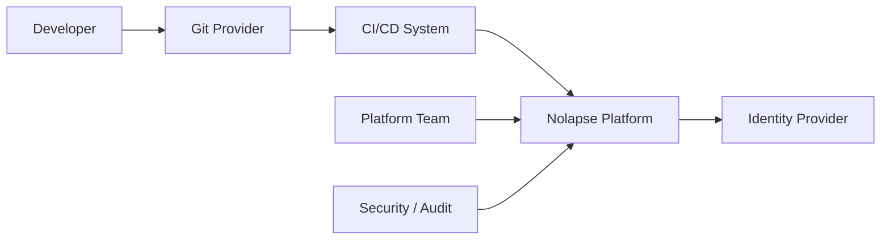
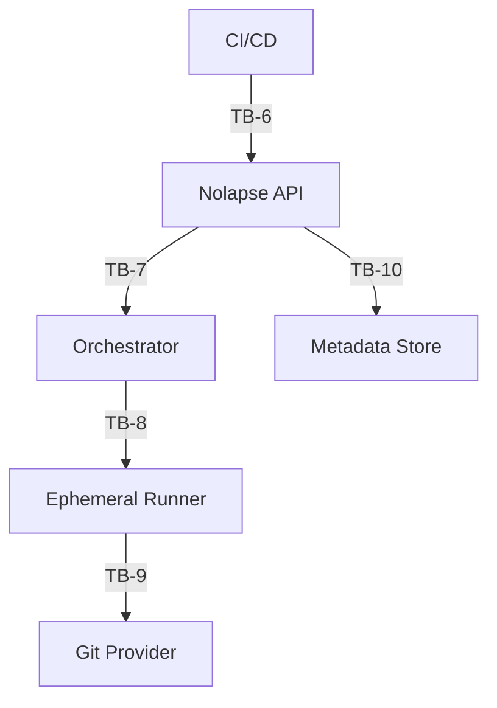
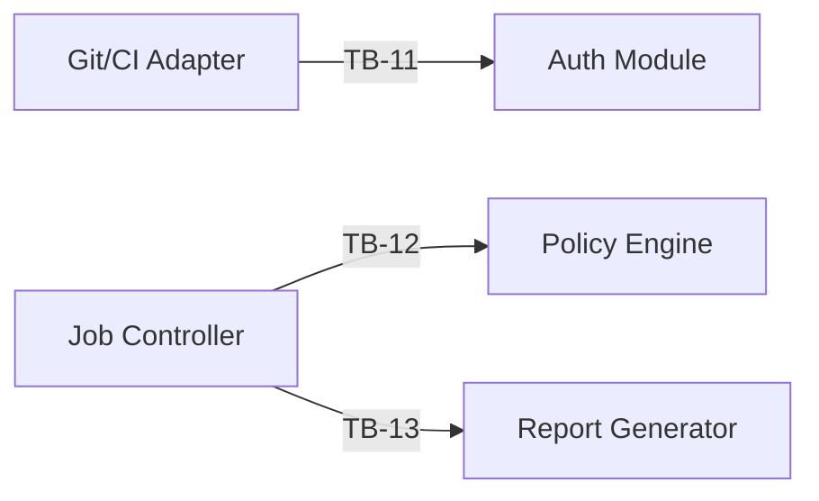
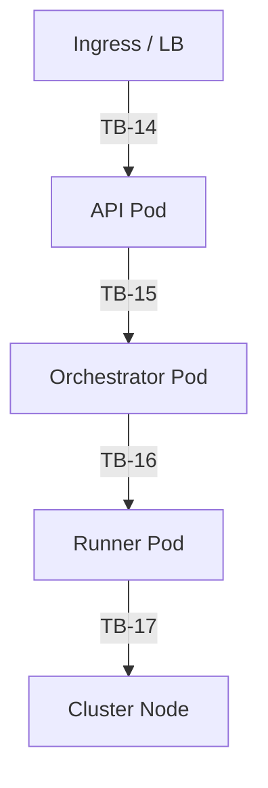

# Nolapse – Trust Boundary Diagram (Mapped to C4 Model)

This document defines the **Trust Boundary Diagram for Nolapse**, explicitly mapped to the **C4 architecture levels**. It identifies **where trust changes**, **what assumptions break**, and **which controls must apply**. This is a core artifact for security reviews, threat modeling, and compliance.

---

## 1. What Is a Trust Boundary?

A **trust boundary** exists wherever:

* Authentication or authorization changes
* Data crosses process, network, or privilege boundaries
* Control moves between teams, systems, or tenants

Crossing a trust boundary **always requires security controls**.

---

## 2. Trust Boundary Principles for Nolapse

Nolapse is designed around **explicit trust separation**:

* Control plane vs execution plane
* Enterprise systems vs customer code
* Persistent vs ephemeral environments
* Human vs automated actors

---

## 3. C4 Level 1 – System Context Trust Boundaries

### Actors & Systems

### Trust Boundaries Identified

| Boundary | Description   | Trust Assumption                      |
| -------- | ------------- | ------------------------------------- |
| TB-1     | Human → Git   | Developer identity is verified by Git |
| TB-2     | Git → CI      | CI trusts Git webhooks                |
| TB-3     | CI → Nolapse     | CI identity must be verified          |
| TB-4     | Humans → Nolapse | Strong auth & RBAC required           |
| TB-5     | Nolapse → IdP    | External identity validation          |

---

## 4. C4 Level 2 – Container-Level Trust Boundaries

### Container Trust Boundaries

| Boundary | Crossing              | Why It Matters                             |
| -------- | --------------------- | ------------------------------------------ |
| TB-6     | CI → API              | External automation invoking control plane |
| TB-7     | API → Orchestrator    | Privileged job scheduling                  |
| TB-8     | Orchestrator → Runner | Code execution boundary                    |
| TB-9     | Runner → Git          | Write access to source control             |
| TB-10    | API → DB              | Persistent audit data                      |

---

## 5. C4 Level 3 – Component-Level Trust Boundaries (API)

### Component Boundaries

| Boundary | Risk                  |
| -------- | --------------------- |
| TB-11    | Authentication bypass |
| TB-12    | Policy manipulation   |
| TB-13    | Report tampering      |

---

## 6. C4 Level 4 – Deployment Trust Boundaries (Kubernetes)

### Deployment Boundaries

| Boundary | Description                  |
| -------- | ---------------------------- |
| TB-14    | Network perimeter            |
| TB-15    | Control-plane internal trust |
| TB-16    | Ephemeral execution trust    |
| TB-17    | Container → host escape risk |

---

## 7. Trust Boundary → Security Control Mapping

| Boundary      | Required Controls                 |
| ------------- | --------------------------------- |
| TB-3 / TB-6   | OIDC, mTLS, token expiry          |
| TB-8          | Ephemeral credentials, isolation  |
| TB-9          | Scoped Git tokens, signed commits |
| TB-14         | TLS, WAF, rate limits             |
| TB-16 / TB-17 | Seccomp, AppArmor, rootless       |

---

## 8. Key Security Assertions

* **No trust is transitive** across boundaries
* **Runners are never trusted** beyond a single job
* **Git is the immutable system of record**
* **Policies cannot be bypassed** by design

---

## 9. Reviewer Checklist

* [ ] All boundaries authenticated
* [ ] Least privilege enforced
* [ ] Audit logs present
* [ ] Secrets never cross boundaries in plaintext

---

**End of Trust Boundary Diagram**
