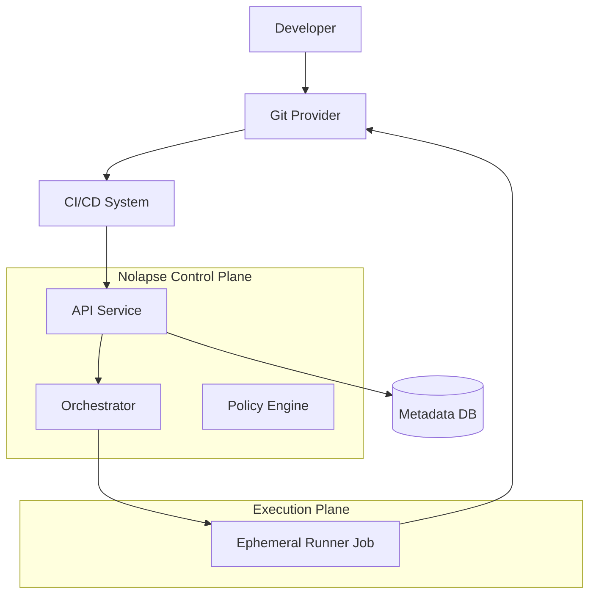
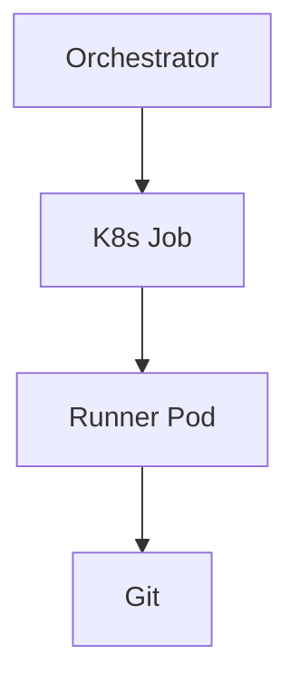
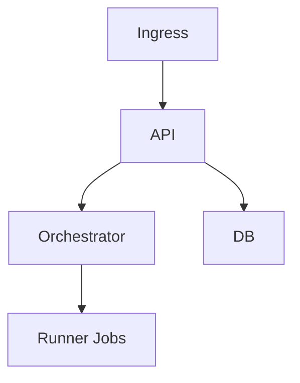

# Nolapse – Architecture Decision Records

## CTO & Engineering Baseline

This document defines the **reference architecture for Nolapse**, based on the **approved tech stack** and earlier decisions (C4, STRIDE, Trust Boundaries, Deployment Variants, Cost Model).

It is the **single architectural blueprint** engineering teams should follow when implementing Nolapse.

---

## 1. Architectural Goals

The reference architecture must:

* Enforce **control-plane vs execution-plane separation**
* Be secure by default (least privilege, isolation)
* Scale horizontally with predictable cost
* Support single-tenant, hybrid, and SaaS deployments
* Remain evolvable without large refactors

---

## 2. High-Level Reference Architecture

---

## 3. Control Plane Architecture

### 3.1 Responsibilities

* Authentication & authorization
* Job lifecycle management
* Policy evaluation
* Git & CI adapters
* Audit metadata persistence

### 3.2 Services

#### API Service (Go)

* External REST API
* Internal gRPC endpoints
* Stateless

#### Orchestrator (Go)

* Queue-based scheduler
* Handles bulk & scheduled jobs
* Enforces concurrency limits

#### Policy Engine (Embedded)

* Evaluates coverage deltas
* Deterministic, side-effect free

---

## 4. Execution Plane Architecture

### 4.1 Responsibilities

* Clone repositories
* Detect language & framework
* Execute tests with coverage
* Generate normalized reports

### 4.2 Execution Model

* Implemented as **Kubernetes Jobs**
* One job per execution
* No shared state
* Time- and resource-limited

---

## 5. Communication Patterns

| Interaction           | Protocol     | Notes             |
| --------------------- | ------------ | ----------------- |
| CI → API              | HTTPS (OIDC) | External boundary |
| API → Orchestrator    | gRPC         | Internal, trusted |
| Orchestrator → Runner | K8s API      | Job spec          |
| Runner → Git          | HTTPS / SSH  | Scoped tokens     |

---

## 6. Data & State Management

### 6.1 Systems of Record

| Data               | System of Record  |
| ------------------ | ----------------- |
| Coverage baselines | Git repositories  |
| Execution metadata | Postgres          |
| Logs & metrics     | Loki / Prometheus |

### 6.2 State Rules

* Control plane is stateless
* Runners are ephemeral
* Git history is immutable

---

## 7. Security Architecture Alignment

* Auth at every trust boundary
* No long-lived credentials in runners
* Scoped Git tokens
* Mandatory policy evaluation

This architecture directly maps to:

* STRIDE threat model
* Trust Boundary Diagram

---

## 8. Deployment Reference (Kubernetes)

### Namespace Layout

* `nolapse-system`
* `nolapse-runners`

---

## 9. Scalability Characteristics

* Control plane scales by replicas
* Execution plane scales by jobs
* Queue decouples load

Supports:

* Hundreds of repos per hour (single-tenant)
* Tens of thousands per day (SaaS)

---

## 10. Failure Isolation Strategy

* Per-repo job isolation
* Partial success allowed
* No cascading failures

---

## 11. Extension Points

* New language runners
* Additional Git providers
* Alternative execution backends

---

## 12. Architectural Non-Goals

* No shared execution state
* No persistent worker pools
* No direct DB writes from runners

---

## 13. Implementation Guardrails

* Do not bypass API for orchestration
* Do not store code outside runners
* Do not trust runner input

---

## 14. Reference Architecture Summary

> **This architecture prioritizes security isolation first, operational simplicity second, and cost efficiency third.**

It enables Nolapse to grow from:

* OSS → Enterprise → SaaS
  without architectural rewrites.

---

**End of Architecture Decision Records**
