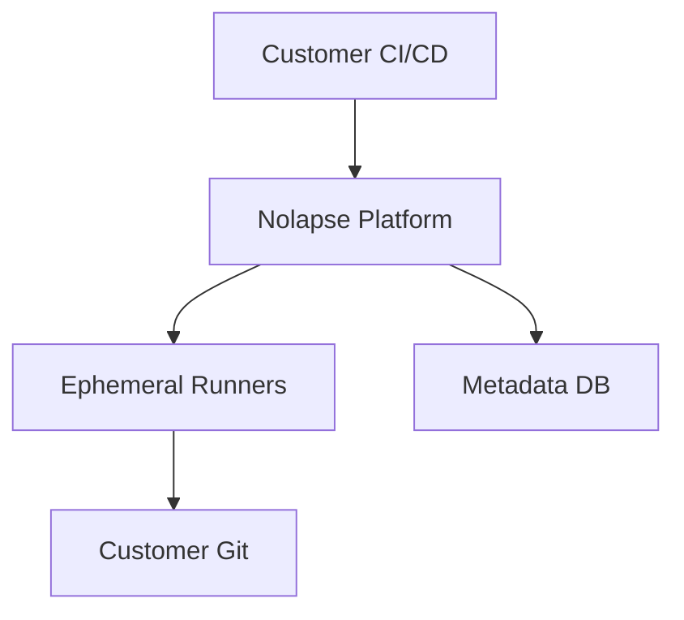
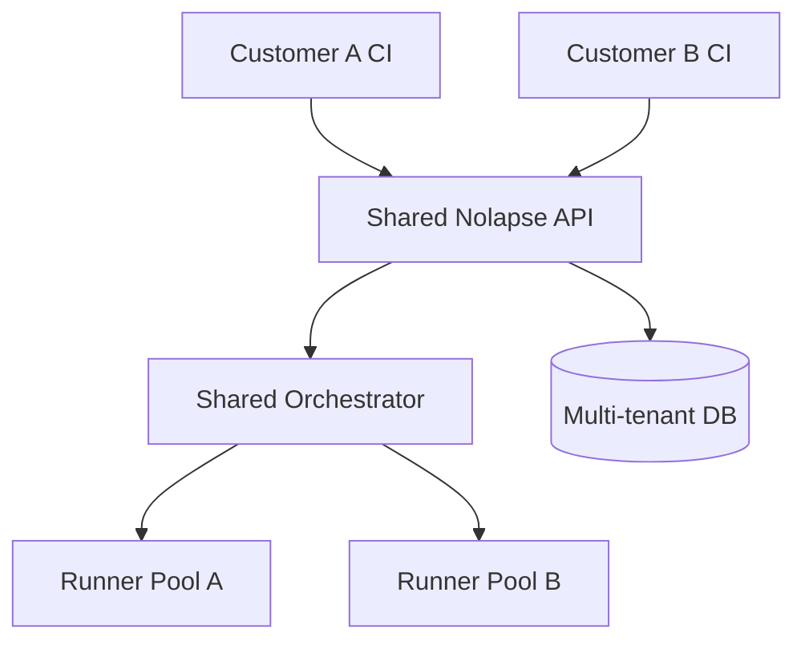
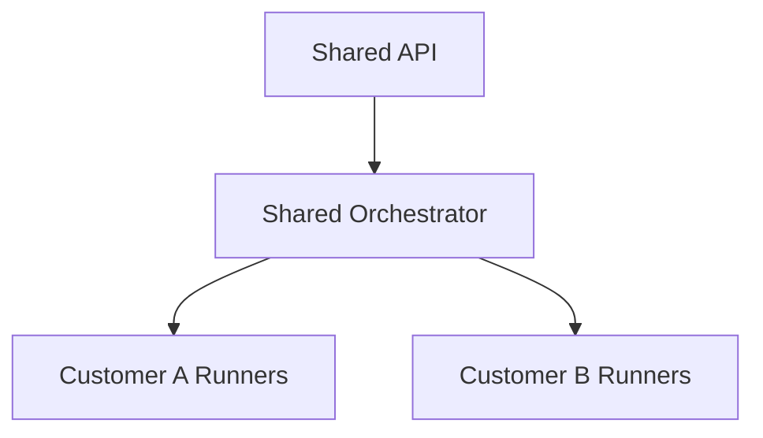

# Nolapse – Deployment Variants

This section defines **production deployment variants for Nolapse**, from a CTO and platform-architecture perspective. It compares **Single-Tenant Enterprise Deployments** with **Multi-Tenant SaaS Deployments**, including trade-offs, security posture, cost, and operational complexity.

---

## 1. Why Deployment Variants Matter

Nolapse is designed as a **deployment-flexible platform**, not a fixed SaaS. Enterprises differ in:

* Regulatory constraints
* Data residency requirements
* Security posture
* Procurement models

Supporting multiple deployment variants is a **strategic advantage**, not a technical afterthought.

---

## 2. Variant A: Single-Tenant Deployment (Enterprise-Hosted)

### 2.1 Overview

Each customer runs **their own isolated Nolapse instance**, typically in their cloud or data center.

---

### 2.2 Characteristics

| Dimension      | Single-Tenant      |
| -------------- | ------------------ |
| Isolation      | Physical / logical |
| Data Residency | Full control       |
| Blast Radius   | One customer       |
| Customization  | High               |
| Compliance     | Strong             |

---

### 2.3 Security Posture

* Dedicated Kubernetes namespace or cluster
* Customer-managed secrets
* Customer-controlled Git credentials
* No cross-tenant trust boundaries

This model is preferred for:

* Regulated industries (finance, healthcare)
* Governments
* Large enterprises with strict infosec controls

---

### 2.4 Operational Model

* Deployed via Helm
* Operated by customer or partner
* Upgrade cadence controlled by customer

**Pros**

* Maximum isolation
* Simplified threat model

**Cons**

* Higher operational overhead
* Slower feature rollout

---

## 3. Variant B: Multi-Tenant SaaS Deployment

### 3.1 Overview

A **shared Nolapse control plane** serves multiple customers, with strict tenant isolation.

---

### 3.2 Characteristics

| Dimension       | Multi-Tenant SaaS      |
| --------------- | ---------------------- |
| Isolation       | Logical (tenant-based) |
| Data Residency  | Region-based           |
| Blast Radius    | Controlled             |
| Customization   | Limited                |
| Cost Efficiency | High                   |

---

### 3.3 Security Posture

* Strong tenant isolation at API and data layers
* Tenant-scoped identities and tokens
* Separate runner pools per tenant or tier
* Continuous security monitoring

This model is preferred for:

* SaaS-first companies
* SMBs and mid-market
* Fast onboarding requirements

---

### 3.4 Operational Model

* Centralized operations
* Continuous delivery
* Shared infrastructure cost

**Pros**

* Rapid onboarding
* Lower per-customer cost
* Faster innovation

**Cons**

* Complex security model
* Higher blast radius risk

---

## 4. Hybrid Variant (Enterprise SaaS)

### Overview

Combines a **shared control plane** with **tenant-dedicated execution planes**.

This is the **default recommended model** for enterprise SaaS.

---

## 5. Variant Comparison Summary

| Aspect          | Single-Tenant | Multi-Tenant | Hybrid |
| --------------- | ------------- | ------------ | ------ |
| Isolation       | ★★★★★         | ★★☆☆☆        | ★★★★☆  |
| Cost Efficiency | ★★☆☆☆         | ★★★★★        | ★★★★☆  |
| Compliance      | ★★★★★         | ★★☆☆☆        | ★★★★☆  |
| Scale           | ★★☆☆☆         | ★★★★★        | ★★★★☆  |

---

## 6. CTO Recommendation

* **OSS / Community** → CI-only, customer-hosted
* **Enterprise Customers** → Single-tenant or Hybrid
* **SMB / Growth SaaS** → Multi-tenant

Design principle:

> *Optimize for isolation first, then efficiency.*

---

## 7. Future Evolution Path

* Start with **single-tenant reference architecture**
* Introduce **hybrid SaaS**
* Mature into **fully multi-tenant SaaS** with hardened isolation

This phased approach reduces risk while enabling scale.

---

**End of Deployment Variants**
