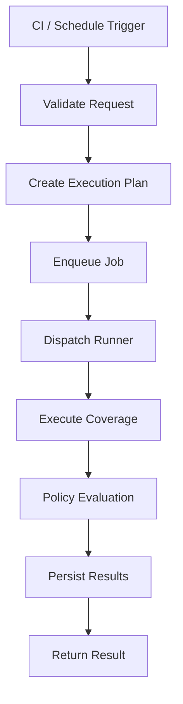
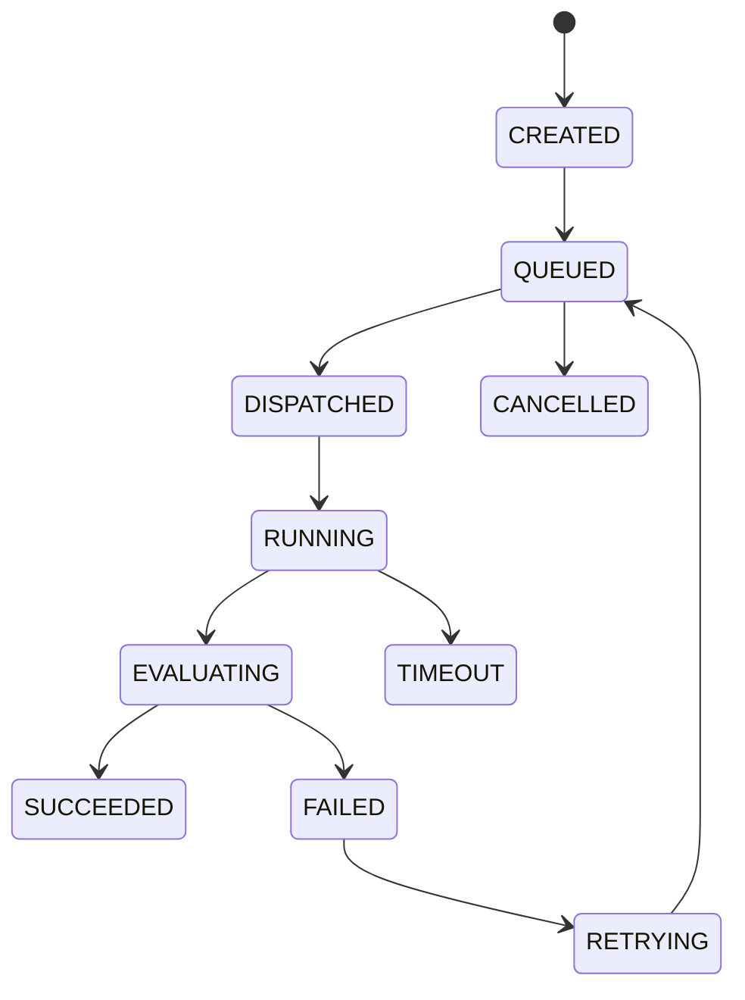

# Nolapse – Execution Lifecycle & State Machine

## Orchestrator ↔ Runner Design (CTO / Platform Core)

This document defines the **heart of the Nolapse platform**: how work is executed safely, predictably, and cost‑efficiently.

It formalizes:

* Execution lifecycle
* Orchestrator → Runner protocol
* Job state machine
* Retry & backoff semantics
* Cost & quota enforcement
* Cache strategy

These decisions directly impact **scalability, security, margins, and developer experience**.

---

## 1. Design Principles

1. **Control plane never executes code**
2. **Runners are fully ephemeral**
3. **Every execution is isolated**
4. **Cost must be measurable per job**
5. **Failures must be explicit and classifiable**

---

## 2. High-Level Execution Lifecycle



---

## 3. Orchestrator → Runner Protocol

### 3.1 Communication Model

* Orchestrator creates **JobSpec**
* JobSpec passed via Kubernetes Job (env + config volume)
* No inbound network access to runner

---

### 3.2 JobSpec (Conceptual)

```yaml
jobId: uuid
repo:
  url: https://git/...
  ref: refs/pull/123/head
execution:
  language: node
  coverageTool: nyc
  timeoutSeconds: 600
policy:
  baselineRef: main
  mode: strict
limits:
  cpu: 2
  memory: 4Gi
cache:
  enabled: true
```

---

## 4. Job State Machine

### 4.1 States



---

### 4.2 State Semantics

| State      | Meaning                     |
| ---------- | --------------------------- |
| CREATED    | Job accepted                |
| QUEUED     | Waiting for capacity        |
| DISPATCHED | Runner scheduled            |
| RUNNING    | Tests executing             |
| EVALUATING | Policy check                |
| SUCCEEDED  | Passed policy               |
| FAILED     | Policy or execution failure |
| TIMEOUT    | Exceeded limits             |
| RETRYING   | Backoff applied             |
| CANCELLED  | Aborted by system           |

---

## 5. Failure Classification

Failures are **typed**, not boolean.

| Failure Type | Description        |
| ------------ | ------------------ |
| INFRA        | Node / K8s issue   |
| TRANSIENT    | Network / registry |
| USER         | Test failures      |
| POLICY       | Coverage violation |
| SYSTEM       | Nolapse bug           |

Only certain failures are retryable.

---

## 6. Retry & Backoff Semantics

### 6.1 Retry Policy

| Failure Type | Retry? | Max Attempts |
| ------------ | ------ | ------------ |
| INFRA        | Yes    | 3            |
| TRANSIENT    | Yes    | 2            |
| USER         | No     | 0            |
| POLICY       | No     | 0            |
| SYSTEM       | Yes    | 1            |

---

### 6.2 Backoff Strategy

* Exponential backoff
* Jitter applied

```text
baseDelay = 30s
maxDelay = 5m
```

---

## 7. Cost & Quota Enforcement

### 7.1 Cost Attribution Model

Cost is tracked per:

* Repo
* Org
* Execution

Metrics:

* CPU-seconds
* Memory-seconds
* Execution duration

---

### 7.2 Quotas

| Scope    | Example Limit       |
| -------- | ------------------- |
| Repo     | 1,000 runs / month  |
| Org      | 50,000 runs / month |
| CI Burst | 20 concurrent       |

Quota breaches:

* Reject new jobs
* Return explicit error

---

## 8. Cache Strategy

### 8.1 Cache Goals

* Reduce execution time
* Reduce compute cost
* Preserve correctness

---

### 8.2 Cache Types

| Cache            | Scope        | Notes          |
| ---------------- | ------------ | -------------- |
| Dependency cache | Per language | npm/pip/maven  |
| Build cache      | Per repo     | Optional       |
| Tool cache       | Global       | Coverage tools |

---

### 8.3 Cache Rules

* Cache is **read-only** during execution
* Cache keys include:

  * Repo hash
  * Lockfile checksum
* Cache miss falls back gracefully

---

## 9. Security Considerations

* No runner receives long-lived secrets
* No shared writable cache
* All artifacts validated before persistence

---

## 10. Observability

Every state transition emits:

* Event
* Metric
* Log entry

This enables:

* Cost attribution
* Audit trails
* Debugging

---

## 11. CTO Summary

> **The execution lifecycle is intentionally boring, explicit, and auditable.**

This design:

* Scales linearly
* Contains failures
* Protects margins
* Simplifies reasoning

It is suitable for **enterprise and SaaS scale**.

---

**End of Execution Lifecycle & State Machine**
