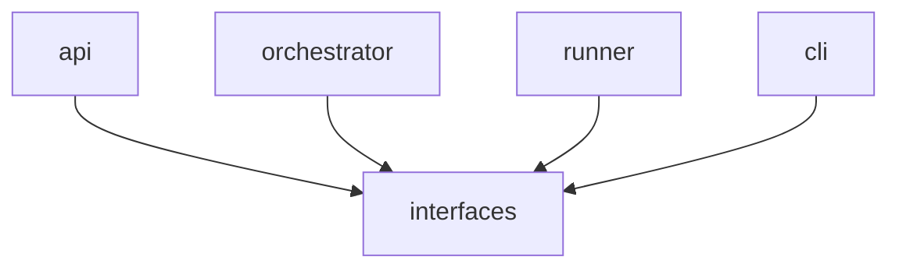
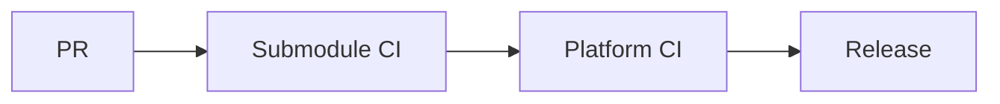

# Nolapse – Hybrid Repository Model using Git Submodules

## CTO / Platform Architecture Refinement

This document refines the previously defined **Hybrid “Polyrepo wrapped in a Monorepo” model** by explicitly introducing **Git submodules** as the enforcement mechanism.

The goal is to achieve:

* **True repository independence** (history, versioning, releases)
* **Strong contract discipline**
* **Centralized visibility and orchestration**
* **Minimal coordination overhead**

This model is intentionally opinionated and optimized for **platform-scale engineering**.

---

## 1. Why Introduce Git Submodules?

While a pure monorepo with logical boundaries works early, it has limitations:

* Independent versioning is social, not enforced
* Release independence is process-driven
* External reuse (OSS, enterprise distribution) is harder

Git submodules give us **hard boundaries** while retaining a **single integration surface**.

> Think of this as **"polyrepos with a canonical integration repo"**.

---

## 2. Conceptual Model

### Mental Model

* Each major Nolapse subsystem is a **real repository**
* The `nolapse-platform` repo acts as:

  * Integration layer
  * Release coordinator
  * Documentation hub

```text
               ┌───────────────────┐
               │ nolapse-platform      │  ← Integration repo
               └───────────────────┘
                 │     │      │
     ┌───────────┘     │      └───────────┐
┌───────────┐   ┌────────────┐   ┌────────────┐
│ nolapse-api  │   │ nolapse-runner│   │ nolapse-cli   │  ← Real repos
└───────────┘   └────────────┘   └────────────┘
```

---

## 3. Repository Topology

### 3.1 Integration Repository (Root)

```
nolapse-platform/
├── services/
│   ├── api/            # submodule → nolapse-api
│   ├── orchestrator/   # submodule → nolapse-orchestrator
│   └── policy-engine/  # submodule → nolapse-policy
│
├── runtimes/
│   ├── runner-core/    # submodule → nolapse-runner-core
│   ├── runner-node/    # submodule → nolapse-runner-node
│   └── runner-python/  # submodule → nolapse-runner-python
│
├── interfaces/         # NORMAL repo (not submodule)
│   ├── api-contracts/
│   ├── policy-dsl/
│   └── event-schemas/
│
├── integrations/
│   ├── github/         # submodule → nolapse-gh-action
│   ├── gitlab/         # submodule → nolapse-gitlab-ci
│   └── jenkins/        # submodule → nolapse-jenkins-plugin
│
├── deployments/
│   ├── helm/
│   └── terraform/
│
├── docs/
└── README.md
```

---

### 3.2 Submodule Inventory

| Submodule         | Purpose           | Ownership       |
| ----------------- | ----------------- | --------------- |
| nolapse-api          | Control plane API | Platform Core   |
| nolapse-orchestrator | Job scheduler     | Platform Core   |
| nolapse-policy       | Policy engine     | Platform Core   |
| nolapse-runner-core  | Shared runtime    | Runtime / Infra |
| nolapse-runner-*     | Language runners  | Runtime / Infra |
| nolapse-cli          | Developer CLI     | DX Team         |
| nolapse-gh-action    | GitHub Actions    | Integrations    |

---

## 4. Contract & Dependency Discipline

### 4.1 Interfaces Are NOT Submodules

The `/interfaces` directory is **the only shared codebase** and lives **directly inside the integration repo**.

Rules:

* All repos import contracts from `/interfaces`
* No submodule imports another submodule
* Breaking changes require explicit version bumps

---

### 4.2 Dependency Direction



Never:

```text
api → runner
runner → api
```

---

## 5. Versioning & Release Model

### 5.1 Submodule Versioning

* Each submodule has its own semantic version
* Releases happen independently

Example:

```
nolapse-api v1.4.0
nolapse-runner-node v0.9.2
nolapse-cli v0.7.0
```

---

### 5.2 Platform Release (Integration)

The integration repo pins **exact commit SHAs** of submodules.

```text
Platform Release v1.0
  nolapse-api            @ a1b2c3
  nolapse-orchestrator   @ d4e5f6
  nolapse-runner-node    @ 9a8b7c
```

This creates **reproducible enterprise builds**.

---

## 6. CI/CD Implications

### 6.1 Submodule CI

* Each repo has its own CI
* Runs unit + integration tests
* Publishes artifacts

---

### 6.2 Platform CI (Critical)

The `nolapse-platform` CI:

* Updates submodule pointers
* Runs end-to-end tests
* Produces release artifacts



---

## 7. Security & Trust Boundary Benefits

* Hard isolation at repo level
* Focused security reviews per repo
* Reduced blast radius
* Clear supply-chain audit trail

This aligns cleanly with:

* STRIDE threat model
* Trust boundary diagram

---

## 8. Operational Trade-offs (Honest View)

### Benefits

* True independence
* Clean OSS / enterprise split
* Precise release control

### Costs

* Git submodule learning curve
* Slightly more CI complexity

> These costs are acceptable for a **platform company**, not for a toy project.

---

## 9. CTO Recommendation

> **Adopt Git submodules for all major Nolapse subsystems, with a single integration repository as the source of truth.**

Non-negotiables:

* Interfaces live only in integration repo
* No submodule-to-submodule imports
* Platform CI owns releases

---

## 10. When NOT to Use This Model

Do NOT use this model if:

* Team < 3 engineers
* No enterprise ambitions
* No need for independent releases

Nolapse clearly exceeds these thresholds.

---

## 11. Next Logical Step

With repo topology finalized, the next design is:

👉 **Execution lifecycle & state machine** (orchestrator ↔ runner)

This is where cost, scale, and reliability are decided.

---

**End of Git Submodule–Based Hybrid Repository Model**
