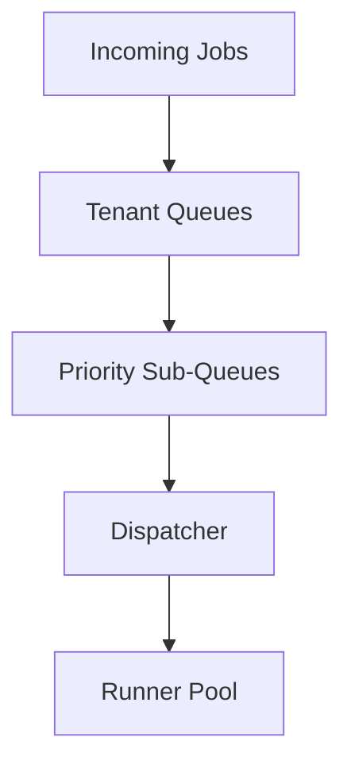

# Nolapse – Orchestrator Scheduling Algorithm

## Queues, Fairness, Priority & Multi-Tenant Isolation

This document formalizes the **Orchestrator Scheduling Algorithm** for Nolapse. It defines how execution jobs are queued, prioritized, isolated, and dispatched to runners in a way that is **fair, predictable, cost-aware, and enterprise-safe**.

This is a **core control-plane algorithm** and directly impacts:

* SaaS margins
* Enterprise SLAs
* CI latency
* Platform stability

---

## 1. Scheduling Design Goals

1. **Fairness across tenants** – no single org can starve others
2. **Predictable CI latency** – PR checks should feel fast
3. **Explicit prioritization** – critical work runs first
4. **Hard isolation** – tenants never interfere
5. **Cost visibility** – scheduling decisions must be measurable

---

## 2. Scheduling Model Overview

Nolapse uses a **Hierarchical Queue Model** with:

* Tenant-level isolation
* Priority-aware sub-queues
* Global capacity limits



---

## 3. Queue Hierarchy

### 3.1 Tenant Queue (Level 1)

Each tenant (org / customer) has a **dedicated top-level queue**.

Properties:

* Enforced concurrency limits
* Enforced quota ceilings
* Isolation from other tenants

Example:

```
Queue: tenant:acme-corp
Queue: tenant:globex
```

---

### 3.2 Priority Sub-Queues (Level 2)

Within each tenant queue, jobs are split by priority:

| Priority | Use Case | Examples         |
| -------- | -------- | ---------------- |
| P0       | Critical | Main branch PRs  |
| P1       | High     | Release branches |
| P2       | Normal   | Feature PRs      |
| P3       | Low      | Scheduled scans  |

Example:

```
tenant:acme:P0
tenant:acme:P1
tenant:acme:P2
tenant:acme:P3
```

---

## 4. Priority Rules

Priority is derived from:

* Trigger source (PR > scheduled)
* Branch type (main > feature)
* Explicit overrides (admin)

Priority is **immutable once enqueued**.

---

## 5. Fairness Algorithm

### 5.1 Algorithm Choice

Nolapse uses **Weighted Fair Queuing (WFQ)** at the tenant level.

Rationale:

* Predictable fairness
* Simple mental model
* Adjustable per plan (Free / Team / Enterprise)

---

### 5.2 Tenant Weights

| Plan       | Weight |
| ---------- | ------ |
| Free       | 1      |
| Team       | 3      |
| Enterprise | 6      |

Higher weight ≠ unlimited usage. It affects **share of available capacity**.

---

### 5.3 Fairness Enforcement

* Scheduler cycles tenants in proportion to weight
* Within a tenant, highest priority job is selected
* Idle capacity is redistributed

---

## 6. Dispatcher Logic (Simplified)

```pseudo
while capacity_available:
  for tenant in weighted_round_robin(tenants):
    if tenant.has_quota() and tenant.has_jobs():
      job = tenant.next_highest_priority_job()
      dispatch(job)
```

---

## 7. Multi-Tenant Isolation Guarantees

### 7.1 What Is Isolated

* Queue state
* Concurrency limits
* Execution runners (hybrid model)
* Cost accounting

---

### 7.2 What Is Shared

* Control plane services
* Scheduler logic
* Observability stack

No tenant can:

* See another tenant’s jobs
* Consume another tenant’s quota
* Starve another tenant indefinitely

---

## 8. Backpressure & Throttling

### 8.1 When Backpressure Applies

* Tenant exceeds concurrency limit
* Tenant exceeds quota
* Global capacity exhausted

---

### 8.2 Behavior

| Condition         | Action          |
| ----------------- | --------------- |
| Tenant limit hit  | Queue locally   |
| Quota exceeded    | Reject new jobs |
| Global exhaustion | Slow enqueue    |

CI receives explicit signals (HTTP 429 / retry-after).

---

## 9. Starvation Prevention

* WFQ guarantees minimum progress
* Low-priority jobs age over time
* Aging increases effective priority

---

## 10. Scheduling Observability

Metrics emitted:

* Queue depth per tenant
* Wait time per priority
* Dispatch latency
* Fairness skew

These feed:

* Autoscaling decisions
* SLA reporting
* Cost optimization

---

## 11. Failure Handling

* Failed dispatch → job returns to queue
* Retry rules applied per failure type
* Poison jobs quarantined

---

## 12. CTO Summary

> **Scheduling is a business decision encoded as an algorithm.**

This design:

* Protects enterprise customers
* Keeps SaaS fair
* Enables monetization tiers
* Scales without surprise behavior

It is intentionally simple, explicit, and observable.

---

**End of Orchestrator Scheduling Algorithm**
