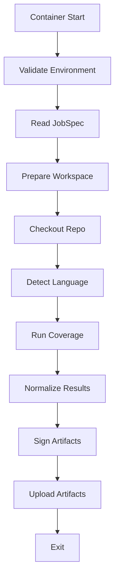

# Nolapse – Runner Implementation Blueprint

## Execution Plane Design (Security, Correctness, Cost)

This document formalizes the **Runner implementation** for Nolapse. It defines exactly how runners start, execute, normalize results, sign artifacts, and exit. This is a **security-critical component** and must be deterministic, minimal, and auditable.

---

## 1. Runner Design Principles

1. **Ephemeral by default** – no state survives a run
2. **No trust assumptions** – runner input is untrusted
3. **Deterministic behavior** – same inputs → same outputs
4. **Minimal surface area** – fewer binaries, fewer risks
5. **Explicit failure signaling** – exit codes must be meaningful

---

## 2. Runner Boot Sequence

### 2.1 High-Level Boot Flow



---

### 2.2 Boot Guardrails

* Fail fast if required env vars missing
* Hard timeout enforced
* Read-only filesystem except workspace

---

## 3. Language Adapter Model

### 3.1 Adapter Abstraction

Each language adapter implements a common interface:

```text
prepare()
run_tests()
collect_coverage()
```

Adapters live in **language-specific runner images**.

---

### 3.2 Supported Adapters (Initial)

| Language | Tool        |
| -------- | ----------- |
| Node.js  | nyc / jest  |
| Python   | coverage.py |
| Java     | JaCoCo      |
| .NET     | coverlet    |
| Go       | go test     |

---

### 3.3 Adapter Isolation

* Adapters cannot call network by default
* Tool versions pinned
* Adapter errors classified as USER failures

---

## 4. Coverage Normalization

### 4.1 Why Normalize?

Coverage tools output incompatible formats. Nolapse normalizes them into a **single canonical schema**.

---

### 4.2 Canonical Coverage Schema

```json
{
  "summary": {
    "lines": 85.2,
    "branches": 71.0,
    "functions": 90.1
  },
  "files": [
    {
      "path": "src/app.js",
      "lines": 88.0
    }
  ]
}
```

---

### 4.3 Normalization Rules

* Percentages rounded to 2 decimals
* Missing metrics explicitly set to null
* File paths normalized (repo-relative)

---

## 5. Artifact Generation & Signing

### 5.1 Generated Artifacts

* `coverage.json` (canonical)
* `coverage.md` (human-readable)
* `metadata.json` (execution context)

---

### 5.2 Signing Model

Artifacts are signed **inside the runner** using:

* Short-lived signing key
* Provided at runtime by orchestrator

Signature stored as:

```
coverage.json.sig
```

---

### 5.3 Verification

* Orchestrator verifies signature before persisting
* Invalid signatures → SYSTEM failure

---

## 6. Exit Code Semantics

Exit codes are **contractual**.

| Code | Meaning             |
| ---- | ------------------- |
| 0    | Success             |
| 10   | User test failure   |
| 11   | Coverage tool error |
| 20   | Policy violation    |
| 30   | Timeout             |
| 40   | Infra error         |
| 50   | System error        |

The runner **never** decides pass/fail of policy — it only reports facts.

---

## 7. Security Hardening

* Non-root user
* Seccomp / AppArmor
* No outbound network (unless explicitly allowed)
* No secrets persisted

---

## 8. Performance & Cost Controls

* Dependency cache (read-only)
* Parallel test execution (opt-in)
* Resource limits enforced

---

## 9. Observability

Runner emits:

* Structured logs
* Execution timing
* Resource usage summary

All tied to `executionId`.

---

## 10. Failure Classification Mapping

| Failure           | Classification |
| ----------------- | -------------- |
| Adapter crash     | USER           |
| Tool missing      | SYSTEM         |
| Signature invalid | SYSTEM         |
| Timeout           | INFRA          |

---

## 11. Non-Goals

* No test generation
* No test mutation
* No persistent state

---

## 12. CTO Summary

> **Runners are disposable, untrusted workers that report facts — nothing more.**

This design:

* Minimizes blast radius
* Enables auditability
* Keeps execution cheap
* Scales horizontally

It is safe for **enterprise and SaaS environments**.

---

**End of Runner Implementation Blueprint**
