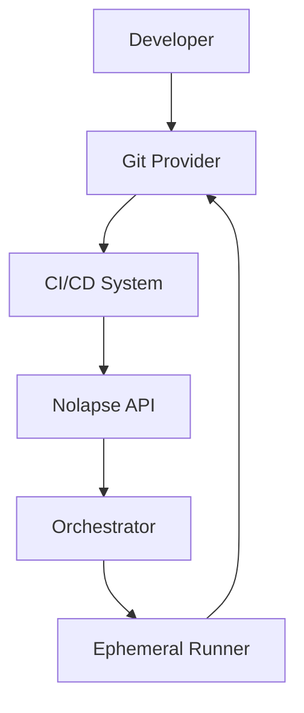
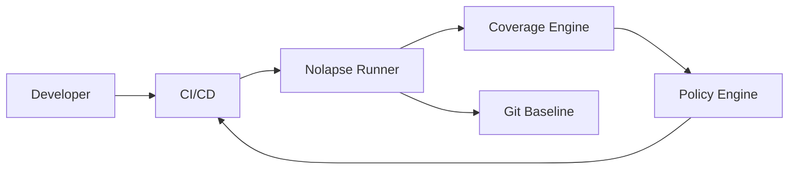
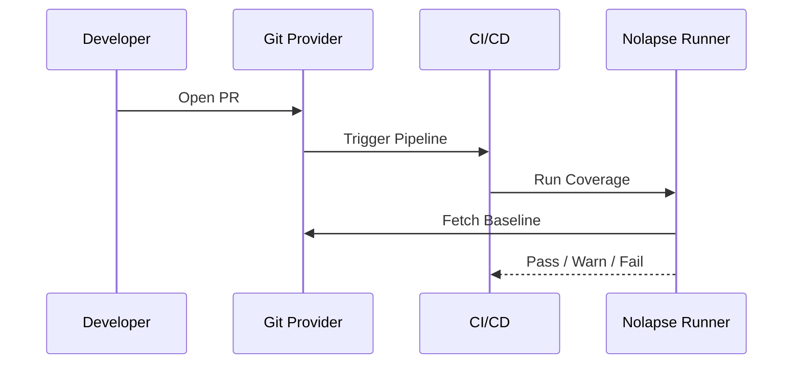
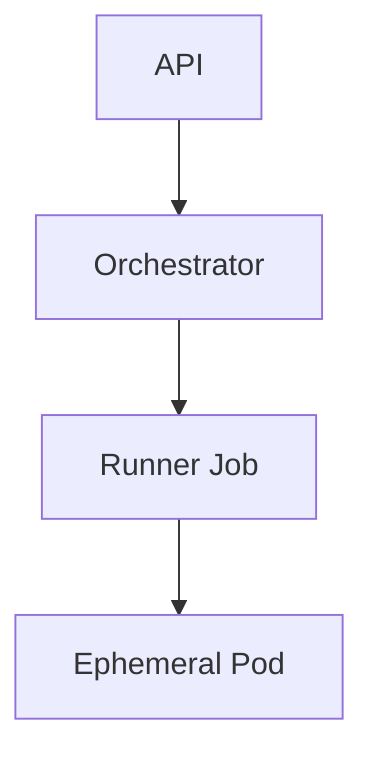

# Nolapse
## Software Requirements Specification (SRS)
**Version:** 1.2 (Gold Standard)  
**Status:** Board / Enterprise Ready  
**Date:** January 2026  
**Author:** Vipul Meehnia

---

## 1. Introduction

### 1.1 Purpose
This document defines the **complete Software Requirements Specification (SRS)** for the *Nolapse*. It is intended to serve as a single source of truth for:
- Architecture Review Boards (ARB)
- Platform & DevOps Engineering teams
- Security & Compliance teams
- Executive leadership and investors

### 1.2 Problem Statement
Large engineering organizations operate hundreds or thousands of repositories across diverse technology stacks. Test coverage practices are often:
- Inconsistent across teams
- Enforced locally rather than centrally
- Lost over time with tooling changes

This results in:
- Quality blind spots
- Accumulating technical debt
- Audit and compliance risk

Nolapse addresses this gap by making **test coverage a governed, versioned, and enforceable artifact**.

---

## 2. Business Context

### 2.1 Enterprise Challenges
- Polyglot codebases (Java, JS, Python, Go, .NET, etc.)
- Multiple Git providers and CI/CD tools
- No single source of truth for coverage baselines
- Manual audits and ad-hoc reporting

### 2.2 Business Objectives
- Establish coverage as an enterprise quality control
- Reduce audit preparation time
- Enable engineering leadership visibility
- Shift coverage left into CI/CD pipelines

---

## 3. Product Vision & Principles

### 3.1 Vision
> **Treat test coverage as enterprise infrastructure, not a developer preference.**

### 3.2 Guiding Principles
- Git-native
- CI/CD-first
- Cloud-agnostic
- Policy-driven
- Audit-ready by default
- Ecosystem-first
- Integration-native

---

## 4. Scope

### 4.1 In Scope
- Repository discovery
- Language/framework detection
- Coverage execution
- Baseline generation & storage
- CI enforcement
- Policy evaluation
- Audit reporting

### 4.2 Out of Scope
- Test case generation
- Functional or UI testing
- Static analysis beyond coverage

---

## 5. Stakeholders & Personas

| Persona | Responsibility |
|------|---------------|
| Developer | Receives fast PR feedback |
| Platform Team | Operates Nolapse |
| Engineering Manager | Tracks quality trends |
| Security / Audit | Validates compliance |
| Executives | Governance & risk visibility |

---

## 6. Assumptions & Constraints

- Repositories already contain tests
- CI/CD systems are available
- Docker or container runtime is accessible
- Git write access is available via service accounts

---

## 7. Supported Git Platforms

- GitHub (Cloud & Enterprise)
- GitLab (Cloud & Self-Managed)
- Bitbucket (Cloud & Data Center)
- Azure DevOps Repos
- Gitea / Gerrit (limited support)

---

## 8. CI/CD Integration Model

### 8.1 Supported CI/CD Systems
- GitHub Actions
- GitLab CI
- Jenkins
- Bitbucket Pipelines
- Azure DevOps
- CircleCI
- Argo / Tekton

### 8.2 Modes of Operation
- **CI-only mode** (PR enforcement)
- **Central orchestrator mode** (bulk baseline scans)
- **Hybrid mode** (enterprise default)

---

## 9. High-Level Architecture

### 9.1 Architectural Overview



---

## 10. Component Architecture

| Component | Responsibility |
|---------|----------------|
| API | External interface & auth |
| Orchestrator | Job scheduling & coordination |
| Runner | Executes coverage |
| Policy Engine | Evaluates thresholds |
| Adapter | Git / CI integration |

---

## 11. Data Flow Diagram (DFD)



---

## 12. Sequence Diagram – Pull Request Flow



---

## 13. Functional Requirements

### 13.1 Repository Discovery
- Must support API-based discovery
- Regex-based filtering
- Project / org scoping

### 13.2 Coverage Execution
- Dockerized isolation
- Language auto-detection
- Configurable timeouts

### 13.3 Baseline Management
- Stored in-repo under `.audit/coverage/`
- Versioned via Git

---

## 14. Non-Functional Requirements

- Scalability: 500+ repos per run
- Security: No code persistence
- Reliability: Retry on transient failures
- Observability: Central logs & metrics

---

## 15. Security Architecture

- Least-privilege service accounts
- Secrets via CI secret managers
- No long-lived credentials on runners

---

## 16. Secrets Management

- GitHub Secrets
- GitLab CI Variables
- Kubernetes Secrets
- Vault (Enterprise)

---

## 17. Deployment Models

- Kubernetes (EKS/GKE/AKS)
- VM-based runners
- Hybrid enterprise setup

---

## 18. Kubernetes Architecture



---

## 19. Helm Chart Specification

- nolapse-api
- nolapse-orchestrator (CronJob)
- nolapse-runner (Job)
- values.yaml for policy & scale

---

## 20. Configuration DSL (nolapse.yaml)

```yaml
baseline:
  mode: strict
  allowedDrop: 1.0
languages:
  autodetect: true
ci:
  failOnViolation: true
notifications:
  slack: true
```

---

## 21. Policy Engine

- Strict
- Warn-only
- Advisory
- Org-level overrides

---

## 22. Baseline Management

- Timestamped reports
- Diff-based comparison
- Noise suppression

---

## 23. Git Operations

- Temporary branches
- Service account commits
- Optional auto-merge

---

## 24. Failure & Retry Handling

- Per-repo isolation
- Configurable retries
- Partial success allowed

---

## 25. Observability & Monitoring

- Central execution logs
- Metrics: success rate, avg runtime
- Exportable audit reports

---

## 26. Scalability Model

- Horizontal runner scaling
- Queue-based orchestration
- Rate-limited Git access

---

## 27. Performance Considerations

- Parallel execution
- Caching dependencies
- Incremental baselines

---

## 28. Compliance & Audit

- Immutable Git history
- Exportable CSV/JSON
- SOC2 / ISO readiness

---

## 29. OSS vs Enterprise Edition

| Feature | OSS | Enterprise |
|------|-----|-----------|
| CI enforcement | ✅ | ✅ |
| Orchestration | ❌ | ✅ |
| Policy engine | ❌ | ✅ |
| Dashboards | ❌ | ✅ |

---

## 30. SaaS Monetization Model

| Tier | Repos | Price | Target |
| --- | --- | --- | --- |
| Free | Up to 10 | $0 (always) | OSS, individual devs, POC |
| Team | Up to 100 | $500/month ($5,000/year) | 10–200 engineer teams |
| Enterprise | Unlimited | From $24,000/year (custom) | 200+ engineers, regulated industry |

Billing dimensions:
- Active repos
- Executions per month
- Policy definitions
- Compliance features (SSO, audit packages)

---

## 31. API Contract (Excerpt)

```http
POST /api/v1/execute
GET  /api/v1/baselines/{repo}
GET  /api/v1/audit/export
```

---

## 32. CI/CD Templates (Excerpt)

### GitHub Actions

```yaml
- uses: nolapse-dev/coverage-action@v1
  with:
    policy: strict
```

---

## 33. Risks & Mitigations

| Risk | Mitigation |
|----|-----------|
| Repo failures | Isolation |
| Scale limits | Horizontal runners |
| Adoption | CI-native UX |

---

## 34. Product Roadmap

### Phase 1
- Core platform

### Phase 2
- Governance & dashboards

### Phase 3
- Intelligence & insights

---

## 35. Appendix

- Glossary
- References
- Change log

---

**End of SRS**

